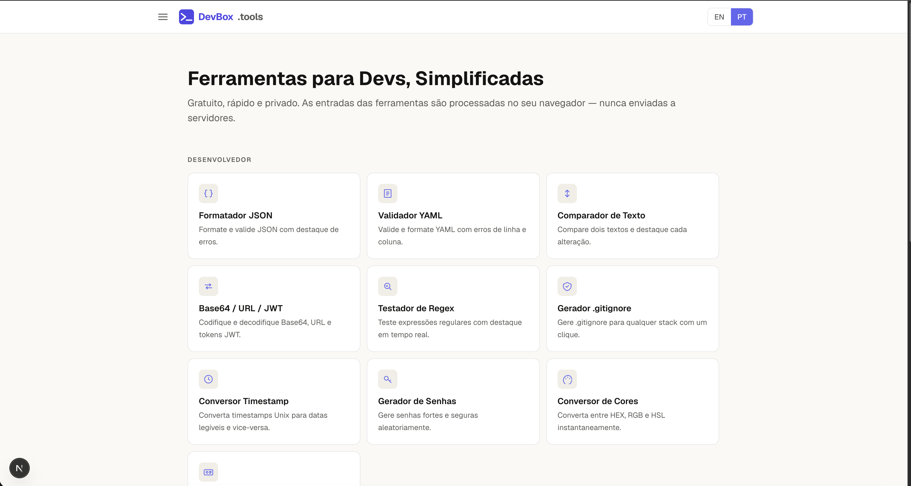

<div align="center">
  
  <h1>DevBox Tools</h1>
  <p><strong>Free, fast, privacy-first developer tools — everything runs in your browser.</strong></p>

  <p>
    <a href="https://devbox-tools-puce.vercel.app"></a>
    
    
    
    
  </p>

  <p>
    <a href="https://devbox-tools-puce.vercel.app"><strong>→ devbox-tools-puce.vercel.app</strong></a>
  </p>
</div>

---

## Screenshot



---

## Tools

| Category | Tool | Description |
|----------|------|-------------|
| **Developer** | JSON Formatter | Format, minify, and validate JSON with syntax highlighting |
| | YAML Validator | Validate YAML and convert to JSON |
| | Text Diff | Side-by-side diff of two text blocks |
| | Encoder / Decoder | Base64, URL-encode, HTML entities |
| | Regex Tester | Live regex match, groups, and flags |
| | .gitignore Generator | Generate `.gitignore` for any stack |
| | Timestamp Converter | Unix ↔ human-readable date/time |
| | Password Generator | Configurable secure password generator |
| | Color Converter | HEX ↔ RGB ↔ HSL conversion |
| | CPF / CNPJ Generator | Generate valid CPF and CNPJ numbers for testing |
| **Utilities** | Word Counter | Character, word, sentence, and paragraph count |
| | Unit Converter | Length, weight, temperature, and more |
| | BMI Calculator | Body mass index with WHO classification |
| | Compound Interest | Compound interest with month-by-month table |
| **Guide** | Alphanumeric CNPJ | Comprehensive guide on Brazil's new CNPJ format |

---

## Alphanumeric CNPJ (Brazil)

Starting **January 2026**, the Brazilian Federal Revenue (Receita Federal) began issuing CNPJs in a new **alphanumeric format**. Instead of 14 digits, the new format uses letters and numbers — for example `B3.ON3.R9/0001-10`.

This change affects every system that validates, stores, or displays CNPJ in Brazil:

- **Validation algorithms** must support characters A–Z in positions 1–12
- **Input masks** and regex patterns need to be updated
- **Database schemas** holding CNPJ as `BIGINT` or `VARCHAR(14)` may break
- **APIs** that accept or return CNPJ need new format handling

DevBox Tools includes a detailed guide covering the new format, the updated validation algorithm, migration checklist, and working code examples.

→ [Read the guide](https://devbox-tools-puce.vercel.app/pt/cnpj-alfanumerico) (PT) · [English](https://devbox-tools-puce.vercel.app/en/cnpj-alfanumerico)

---

## Tech Stack

| | |
|--|--|
| Framework | [Next.js 16](https://nextjs.org) — App Router, SSG |
| Language | TypeScript 5 |
| Styling | Tailwind CSS v4 |
| i18n | [next-intl](https://next-intl-docs.vercel.app) — URL-based (`/pt/`, `/en/`) |
| Deployment | [Vercel](https://vercel.com) |
| Tests | [Vitest](https://vitest.dev) |

All tools run entirely client-side. No user input is ever sent to a server or stored anywhere.

---

## Getting Started

### Prerequisites

- Node.js 20+
- npm (or pnpm / yarn)

### Clone and run

```bash
git clone https://github.com/<your-username>/devbox.tools.git
cd devbox.tools
npm install
cp .env.example .env.local
npm run dev
```

Open [http://localhost:3000](http://localhost:3000) in your browser.

The default locale is `/pt`. The English version is at `/en`.

### Environment variables

Copy `.env.example` to `.env.local` and fill in the values you need:

| Variable | Required | Description |
|----------|----------|-------------|
| `NEXT_PUBLIC_SITE_URL` | Yes | Full URL of the deployment (for canonical/OG) |
| `NEXT_PUBLIC_CONTACT_EMAIL` | No | Shown on the Contact page |
| `NEXT_PUBLIC_GITHUB_URL` | No | Link to your GitHub profile |
| `NEXT_PUBLIC_AUTHOR_NAME` | No | Your name in the footer |
| `NEXT_PUBLIC_DONATION_PIX_KEY` | No | Pix key for donations (Brazilian only) |
| `NEXT_PUBLIC_ADSENSE_CLIENT` | No | Google AdSense publisher ID |

Donation and AdSense sections are hidden when the corresponding variable is empty.

### Run tests

```bash
npm test
```

### Build for production

```bash
npm run build
npm start
```

---

## Project Structure

```
src/
├── app/
│   ├── [locale]/          # All pages under locale routing
│   │   ├── json-formatter/
│   │   ├── cpf-cnpj-generator/
│   │   └── ...
│   ├── icon.tsx           # PNG favicon (32×32, Next.js special file)
│   └── icon.svg           # SVG favicon
├── components/            # Shared UI (Sidebar, Footer, LanguageSwitcher…)
├── i18n/                  # next-intl routing config
├── lib/                   # siteConfig, metadata helper
└── middleware.ts          # Locale routing middleware
messages/
├── en.json                # English strings
└── pt.json                # Portuguese strings
```

---

## Contributing

Contributions are welcome! Here is how to get started:

1. **Fork** the repository and clone your fork locally.
2. Create a feature branch: `git checkout -b feat/my-new-tool`.
3. Make your changes. Follow the patterns in existing tool pages:
   - Add a page at `src/app/[locale]/<tool-slug>/page.tsx`
   - Add a client component if the tool needs interactivity
   - Add translation keys to both `messages/en.json` and `messages/pt.json`
   - Add the tool to the sidebar in `src/components/Sidebar.tsx`
4. Run `npm test` and `npm run build` to make sure nothing is broken.
5. Open a **Pull Request** with a clear description of what the tool does and why it belongs here.

### Adding a new tool — checklist

- [ ] `src/app/[locale]/<slug>/page.tsx` — page with `generateMetadata` using `pageMetadata()`
- [ ] Translation keys in `en.json` and `pt.json` under a new namespace
- [ ] Sidebar entry in `Sidebar.tsx`
- [ ] All processing happens client-side (no sensitive data leaves the browser)
- [ ] No hardcoded language strings — everything goes through `useTranslations`

### Privacy rule (non-negotiable)

**Never send user input to any external service.** This includes analytics events. The following data must never appear in GA4, Sentry, or any third-party call: JSON, JWT, regex patterns, CPF, CNPJ, passwords, Pix keys, or any text the user types or pastes.

---

## License

MIT © DevBox Tools contributors. See [LICENSE](LICENSE).

---

<div align="center">
  <sub>Built with Next.js · Deployed on Vercel · Made in Brazil 🇧🇷</sub>
</div>
